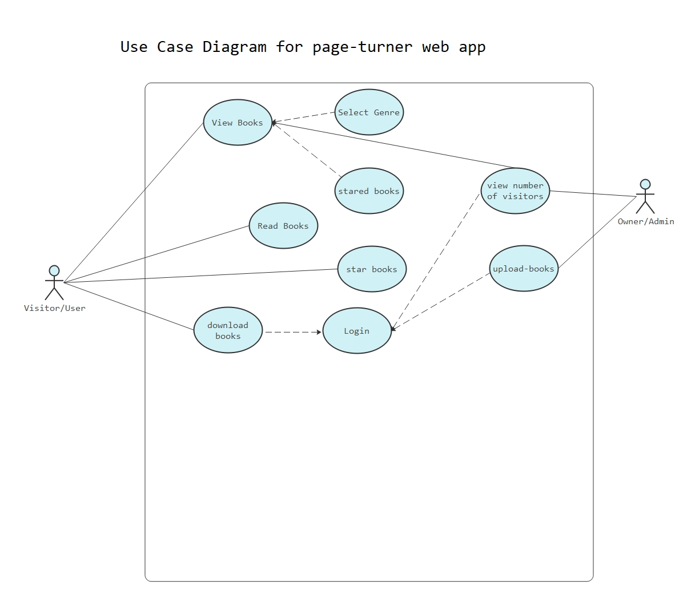

requirements

As a visitor to the site, I want to be able to read book online
As a visitor to the site, I want to be able to search for my favorite book
As a visitor to the site, I want to be able to star my favorite book
As a visitor to the site, I want to be able to access books that I have starred
As a visitor to the site, I want to be able to download books that I wanted to download (downloading requires authenticated user.)

As owner of the site, I want to be able to count number of visitors.
As owner of the site, I want to be able to count number of downloads.
As owner of the site, I want to be able to upload a book.

  <!-- You are encouraged to replace this logo with your own! Otherwise you can also remove it. -->
  
   

  <h3><b>Page-Turner Documentation</b></h3>

<!-- TABLE OF CONTENTS -->

# 📗 Table of Contents

- [📖 About the Project](#about-project)
- [🛠Project-requirements](#project-requirements)
- [Use Case Diagram](#use-case-diagram)
- [ERD](#erd)
- [Database Schema](#database-schema)
- [API Documentation](#api-documentation)
- [Frontend Documentation](#frontend-documentation)
- [🛠 Built With](#built-with)
  - [Tech Stack](#tech-stack)
  - [Key Features](#key-features)
- [🚀 Live Website link](#live-demo)
- [💻 Getting Started](#getting-started)
  - [Setup](#setup)
  - [Prerequisites](#prerequisites)
  - [Install](#install)
  - [Usage](#usage)
  - [Run tests](#run-tests)
  - [Deployment](#triangular_flag_on_post-deployment)
- [👥 Authors](#authors)
- [🔭 Future Features](#future-features)
- [🤝 Contributing](#contributing)
- [⭐️ Show your support](#support)
- [🙏 Acknowledgements](#acknowledgements)
- [❓ FAQ](#faq)
- [📝 License](#license)

<!-- PROJECT DESCRIPTION -->

# 📖 [awesomebooks] 

>

**[awesomebooks]** This is awesome books website, where you register a book with author's name. It also allows you to perform CRUD operations on it.

## Project requirements 

> As a visitor to the site, I want to be able to read book online  
> As a visitor to the site, I want to be able to search for my favorite book 
> As a visitor to the site, I want to be able to star my favorite book 
> As a visitor to the site, I want to be able to access books that I have starred 
> As a visitor to the site, I want to be able to download books that I wanted to download (downloading requires authenticated user.) 
> As owner of the site, I want to be able to count number of visitors. 
> As owner of the site, I want to be able to count number of downloads. 
> As owner of the site, I want to be able to upload a book. 

## Use Case Diagram 

## 🛠 Built With <a name="built-with">HTML, CSS and javascript</a>

### Tech Stack 

> Tech stack
> I have used vanilla js and luxon.js to build this project.

  
Client

  <ul>
    <li><a href="https://css.org/">CSS</a></li>
  </ul>

  
Interactivity

  <ul>
    <li><a href="https://js.com/">vanilla js</a></li>
  </ul>

<!-- Features -->

### Key Features 

> Describe between 1-3 key features of the application.

- **[allows_book_registration]**
- **[performs_CRUD]**

(<a href="#readme-top">back to top</a>)

<!-- LIVE DEMO -->
## Use Case Schenario 
 
 #. Admin Of The Website
 1. Admin logs in to the website as an admin.
 2. Admin uploads a book with Author-name, and genre: Comic, self-helping, fiction, enterpreneurship, auto-biography.

## 🚀 Live Demo 

> Add a link to your deployed project.

- [Live Demo Link](https://ibranista.github.io/awesome-books-ibranista.github.io/)

(<a href="#readme-top">back to top</a>)

<!-- GETTING STARTED -->

## 💻 Getting Started 

To get a local copy up and running, follow these steps.

### Prerequisites

In order to run this project you need:

- open index.html and open it inside your favorite browser.

### Setup

- Create a local directory that you want to clone the repository.

- Open the git-bash in the current created directory.

- Clone this repository

- Open git-bash inside the cloned repository

- run npm install

- after installation has finished you can open index.html

- That's it enjoy :)

### Install

Install this project with:

install the dependancies using node package manager also known as npm.

### Usage

(<a href="#readme-top">back to top</a>)

<!-- AUTHORS -->

## 👥 Authors 

> Mention all of the collaborators of this project.

👤 **Ibrahim**

- GitHub: [@githubhandle](https://github.com/ibranista)
- Twitter: [@twitterhandle](https://twitter.com/ibrahimkedir9)
- LinkedIn: [LinkedIn](https://linkedin.com/in/ibraheem88)

(<a href="#readme-top">back to top</a>)

<!-- FUTURE FEATURES -->

## 🔭 Future Features 

> Describe 1 - 3 features you will add to the project.

- [ user authorization and authentication ] **[new_feature_1]**
- [ add option to read books online ] **[new_feature_2]**
- [ fetch more books online ] **[new_feature_3]**

(<a href="#readme-top">back to top</a>)

<!-- CONTRIBUTING -->

## 🤠Contributing 

Contributions, issues, and feature requests are welcome!

Feel free to check the [issues page](../../issues/).

(<a href="#readme-top">back to top</a>)

<!-- SUPPORT -->

## ⭐️ Show your support 

> support me by giving this project a star

(<a href="#readme-top">back to top</a>)

<!-- ACKNOWLEDGEMENTS -->

## 🙠Acknowledgments 

> Give credit to everyone who inspired your codebase.

I would like to thank Anna for helping me do this project.

(<a href="#readme-top">back to top</a>)

<!-- FAQ (optional) -->

## ❓ FAQ 

> Add at least 2 questions new developers would ask when they decide to use your project.

- **[fill free to use this project in any way that's legal.]**

(<a href="#readme-top">back to top</a>)

<!-- LICENSE -->

## 📠License 

This project is [MIT]("https://opensource.org/licenses/MIT") licensed.

_NOTE: we recommend using the [MIT license](https://choosealicense.com/licenses/mit/) - you can set it up quickly by [using templates available on GitHub](https://docs.github.com/en/communities/setting-up-your-project-for-healthy-contributions/adding-a-license-to-a-repository). You can also use [any other license](https://choosealicense.com/licenses/) if you wish._

(<a href="#readme-top">back to top</a>)

